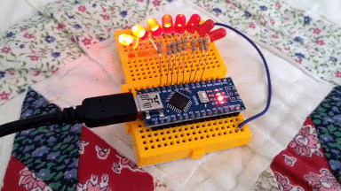

# Arduino-based Knight Rider LED scanner (software PWM)

A very simple project implementing [K.I.T.T's](https://en.wikipedia.org/wiki/Knight_Rider_%281982_TV_series%29)
LED scanner - using an Arduino Nano and 8 LEDs that are controlled via software PWM.

The setup is really simple: all 8 LEDs are connected from pins 2 to 9 of the
Arduino, via current limiting resistors (e.g. 330 Ohm). The rest - i.e. the
logic behind the brightness control to make the LEDs mimick what the 80's show
was doing - is done in software.

This is a good example of handling a requirement for more PWM pins than the one
your microcontroller offers. Note that in the end, the `loop` of the Arduino
code is [completely empty](https://github.com/ttsiodras/KnightRider/blob/master/KnightRider.ino#L59); 
all this is literally done *"in the background"*.

**The inner workings**: `TimerOne` is used, and setup with a value of 64 - so
the ISR is triggered at a frequency of 1MHz / 64 = 15625Hz. These 15625
activations are 'split' into 61 blocks of 256 ticks each, and are used to
perform 8bit PWM at 61 Hz refresh rate:
    
         ,----- switch LED off here
         ,          ,----- switch LED on here
         |          |       ...etc
         V          V
      ,__           ,__           ,__           ,__
      |  |          |  |          |  |          |  |
      |  |          |  |          |  |          |  |
     _'  `----------'  `----------'  `----------'  `-----
                    <---  block -->
      <--- block --->   (of 256 ticks)

Simply put, we use each of the 256 ticks per block, to set on or off the LEDs:

- if a LED is on for all 256 ticks, it is lit at full intensity
- if a LED is off for all 256 ticks, it is completely dark
- values in between => brightness control

Based on an original implementation [here](http://www.root.cz/clanky/knight-rider-na-arduinu/).
