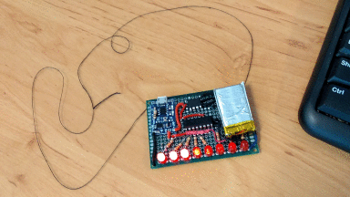

# Arduino-based Knight Rider LED scanner (software PWM)

A very simple project implementing [K.I.T.T's](https://en.wikipedia.org/wiki/Knight_Rider_%281982_TV_series%29)
LED scanner.

The first implementation (branch [arduino-nano](https://github.com/ttsiodras/KnightRider/tree/arduino-nano)) was prototyped on an Arduino
Nano with 8 LEDs controlled via software PWM. All 8 LEDs were connected to
pins 2 to 9 of the Arduino, via current limiting resistors (e.g. 330 Ohm).

Then the design was moved to a more permanent - and portable - form, that of a
perfboard. The Nano was also replaced with an ATtiny85 and a 74HC595 shift register:

 
<em>Thread used so I can hang it around my neck :-)</em>

The ATtiny85 used less power - but didn't have enough pins, so I had to use a
74HC595 shift register to control the LEDs. That in turn made things slower; so
I had to improve the algorithm to make it fast enough to hide the flicker from
human eyes. I also added a LiPo battery to make the design portable; and a TP4056 module
to (a) charge the battery and (b) disconnect it when voltage drops down to 3V.

Generally speaking, this is an example of handling a requirement for more
PWM pins than the one your microcontroller offers. Also note that in the end, the
`loop` of the Arduino code is [completely empty](https://github.com/ttsiodras/KnightRider/blob/master/KnightRider.ino#L65);
all the hard work is literally done *"in the background"*.

# How does it work?

`TimerOne` is used, and setup with a value of 64 - so the ISR is triggered at a
frequency of 1MHz / 64 = 15625Hz. These 15625 activations are 'split' into 61
blocks of 256 ticks each, and are used to perform 8bit PWM at 61 Hz refresh
rate:
    
         ,----- switch LED off here
         ,          ,----- switch LED on here
         |          |       ...etc
         V          V
      ,__           ,__           ,__           ,__
      |  |          |  |          |  |          |  |
      |  |          |  |          |  |          |  |
     _'  `----------'  `----------'  `----------'  `-----
                    <---  block -->
      <--- block --->   (of 256 ticks)

Simply put, each of the 256 ticks per block is used to set on or off the LEDs:

- if a LED is on for all 256 ticks, it is lit at full intensity
- if a LED is off for all 256 ticks, it is completely dark
- values in between => brightness control

That was more or less the essence of the original implementation - which 
I found [here](http://www.root.cz/clanky/knight-rider-na-arduinu/).
But sadly, when I moved things to the ATtiny85 this didn't suffice; the speed on
the tiny MCU was slow enough that the LEDs visibly flickered...

I had to make things faster. First, I went down from 256 to 128 ticks - i.e
made this a 7-bit PWM. This still wasn't fast enough - and then I realized that
the reason is we stay too long in ON or OFF states. Human eyes "integrate"
the time the LED is ON, but will notice if we stay OFF too long.

We simply need to "mix" the ON/OFF periods, instead of "long OFF"/"long ON"...
I did that in a Bresenham-like way: I keep accumulating the "error" of our PWM
setting per LED, until it exceeds 128; the moment it does this, I set the LED
on, and subtract 128.  Overall, this leads to the proper percentage of "time
on" for each LED; but keeps alternating between ON and OFF very fast... thus
completely eliminating flicker.

For more details [just look at the code](https://github.com/ttsiodras/KnightRider/blob/master/KnightRider.ino#L126).

Overall, this was quite fun! You can look at the final result in a
high-resolution video I uploaded on Youtube:

https://www.youtube.com/watch?v=fNdtU0LU9LM

Enjoy!
